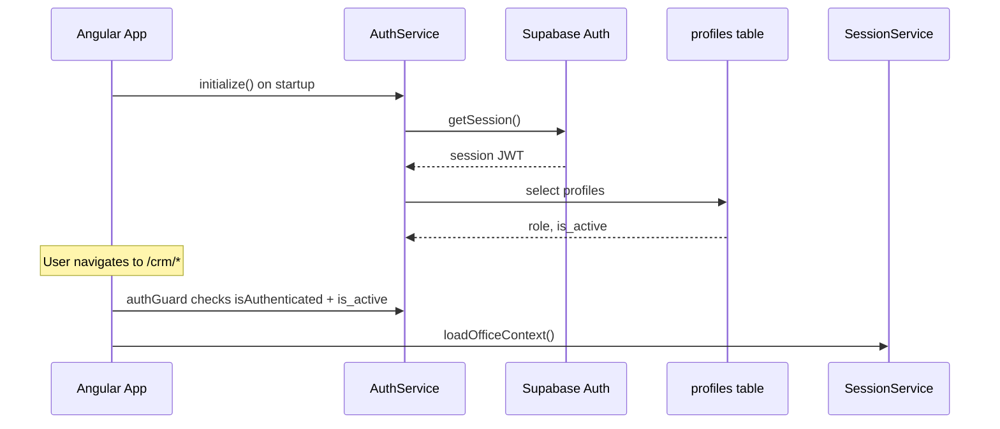

# KOLSS CRM Angular — точки інтеграції фронтенду

Документ описує, що вже реалізовано у **Фазі 1** (інфраструктура), які дані потрібні для роботи фронтенду, і як підключати нові CRM-екрани до Supabase.

---

## 1. Що реалізовано (Фаза 1)

| Компонент | Шлях | Призначення |
|-----------|------|-------------|
| Supabase client | `src/app/core/supabase/supabase.service.ts` | Singleton-клієнт `@supabase/supabase-js` |
| Auth service | `src/app/core/auth/auth.service.ts` | Сесія, профіль, signIn/signOut |
| Session service | `src/app/core/session/session.service.ts` | Офіси користувача, view-as |
| Auth guard | `src/app/core/auth/auth.guard.ts` | Захист `/crm/*`, redirect на `/login` |
| Guest guard | `src/app/core/auth/auth.guard.ts` | Redirect залогіненого з `/login` |
| Role guard | `src/app/core/auth/role.guard.ts` | `superAdminGuard` для `/crm/accounts` |
| Моделі | `src/app/models/database.ts` | TypeScript-типи сутностей |
| Ролі | `src/app/core/roles/roles.ts` | `canManageUsers`, `hasOfficeLeadFilter` |
| Login | `src/app/features/auth/login/login-page.ts` | Екран входу |
| CRM shell | `src/app/features/crm/shell/crm-shell.ts` | Layout + навігація |
| Placeholder pages | `src/app/features/crm/*/` | dashboard, leads, reports, accounts |

---

## 2. Конфігурація середовища

### Файли

| Файл | Коли використовується |
|------|----------------------|
| `src/environments/environment.ts` | Базовий шаблон |
| `src/environments/environment.development.ts` | `ng serve` (file replacement) |
| `src/environments/environment.prod.ts` | `ng build` production |

### Обовʼязкові значення

```typescript
export const environment = {
  production: false,
  supabaseUrl: 'https://YOUR_PROJECT.supabase.co',
  supabaseAnonKey: 'eyJ...',          // anon public key ONLY
  siteUrl: 'http://localhost:4200',
  siteUrlPublic: 'https://crm.kolss.com',
};
```

**Звідки взяти:**

1. Supabase Dashboard → **Project Settings** → **API**
2. `supabaseUrl` = Project URL
3. `supabaseAnonKey` = `anon` `public` key

**Ніколи не додавати у фронтенд:** `SUPABASE_SERVICE_ROLE_KEY`, `IMPORT_WEBHOOK_SECRET`, Telegram/Slack tokens.

### Supabase Auth (Dashboard)

Authentication → URL Configuration:

- **Site URL:** production URL Angular CRM
- **Redirect URLs:**
  - `http://localhost:4200/**`
  - `https://your-production-domain/**`

---

## 3. Маршрути

| Шлях | Guard | Статус |
|------|-------|--------|
| `/` | — | Redirect → `/login` або `/crm/dashboard` |
| `/login` | `guestGuard` | Готово |
| `/design` | — | Дизайн-каталог (без auth) |
| `/crm` | `authGuard` | CRM shell |
| `/crm/dashboard` | `authGuard` | Placeholder |
| `/crm/leads` | `authGuard` | Placeholder → **Фаза 2** |
| `/crm/leads/:id` | `authGuard` | **Фаза 2** (ще не створено) |
| `/crm/reports` | `authGuard` | Placeholder → **Фаза 2** |
| `/crm/accounts` | `authGuard` + `superAdminGuard` | Placeholder → **Фаза 3** |

Query params:

- `/login?next=/crm/leads` — redirect після входу (лише шляхи `/crm/*`)
- `/login?error=deactivated` — деактивований акаунт
- `/login?error=session` — не вдалося завантажити офіси

---

## 4. Auth flow



### Використання в компонентах

```typescript
import { inject } from '@angular/core';
import { AuthService } from '../core/auth/auth.service';
import { SessionService } from '../core/session/session.service';
import { injectSupabase } from '../core/supabase/supabase.service';

const auth = inject(AuthService);
const session = inject(SessionService);
const supabase = injectSupabase();

// Signals (readonly)
auth.session();           // Supabase Session | null
auth.profile();           // Profile | null
auth.sessionContext();    // { user, profile } | null
auth.isAuthenticated();   // boolean

session.officeContext();  // UserOfficeContext | null
session.filterOffices();  // Office[] для фільтра лідів
```

### Sign in / sign out

```typescript
await auth.signIn(email, password);
await auth.signOut();
```

Після `signIn` guard автоматично завантажує `SessionService.loadOfficeContext()`.

---

## 5. Ролі та доступ

| Роль у БД (`profiles.role`) | UI label | Доступ |
|-----------------------------|----------|--------|
| `super_admin` | Супер-адмін | Всі офіси, `/crm/accounts` |
| `curator` | Куратор | Кілька офісів, фільтр по офісу |
| `office_admin` | Адмін офісу | Офіси з memberships |
| `office_member` | Менеджер | Офіси з memberships |

**RLS у Supabase** обмежує дані на рівні БД. Фронтенд додатково:

- ховає `/crm/accounts` для не-super_admin (`superAdminGuard`)
- показує office filter лише якщо `session.officeContext()?.canUseOfficeFilter`

### View-as (super_admin)

Зберігається в `localStorage` ключ `kolss_view_as`:

- `super_admin` | `kyiv` | `warsaw`

Утиліти: `src/app/core/session/view-as.ts`

---

## 6. Таблиці Supabase для фронтенду

### Auth / користувачі

| Таблиця | Колонки (ключові) | Використання |
|---------|-------------------|--------------|
| `profiles` | `id`, `role`, `display_name`, `is_active` | Сесія, guards |
| `user_office_memberships` | `user_id`, `office_id` | Офіси користувача |
| `offices` | `id`, `code`, `name_uk`, `name_pl`, `is_active` | Фільтр, labels |

### Ліди (Фаза 2–3)

| Таблиця | Призначення |
|---------|-------------|
| `leads` | Головна сутність CRM |
| `lead_statuses` | Довідник статусів воронки лідів |
| `lead_comments` | Коментарі на картці ліда |
| `lead_events` | Історія змін |
| `lead_contact_attempts` | Спроби додзвону |
| `lead_showroom_visits` | Візити в шоурум |
| `lead_contracts` | Договори |
| `lead_attachments` | Файли (Storage bucket `lead-attachments`) |

### Проєкти (Фаза 5)

| Таблиця | Призначення |
|---------|-------------|
| `projects` | Воронка виконання |
| `project_stages` | Етапи проєкту |
| `project_comments` | Коментарі проєкту |

### Довідники

| Таблиця | Призначення |
|---------|-------------|
| `loss_reasons` | Причини відмови |
| `workflow_statuses` | Статуси workflow ліда |

Повна схема: `kolss-crm/supabase/migrations/`

---

## 7. Типові Supabase-запити для нових сервісів

### Список лідів (з RLS)

```typescript
const { data, error } = await supabase
  .from('leads')
  .select(`
    id, name, phone, email, lead_status, workflow_status,
    office_id, assigned_to, source_created_at, created_at,
    last_comment, callback_due_at,
    offices (code, name_uk, name_pl),
    profiles:assigned_to (display_name)
  `)
  .order('created_at', { ascending: false })
  .limit(50);
```

### Фільтр по офісу

```typescript
.eq('office_id', selectedOfficeId)
```

### Один лід

```typescript
const { data, error } = await supabase
  .from('leads')
  .select('*')
  .eq('id', leadId)
  .single();
```

### Довідник статусів

```typescript
const { data } = await supabase
  .from('lead_statuses')
  .select('code, label_uk, label_pl, sort_order, is_terminal')
  .order('sort_order');
```

---

## 8. Патерн для нових feature-сервісів (Фаза 2+)

Рекомендована структура:

```
src/app/
├── features/crm/leads/
│   ├── leads-page.ts
│   ├── lead-detail-page.ts
│   └── leads.routes.ts (опційно)
├── services/
│   ├── leads.service.ts      # Supabase queries
│   └── leads-mock.service.ts # Фаза 2: моки
```

### Приклад сервісу

```typescript
import { Injectable, inject } from '@angular/core';
import { injectSupabase } from '../core/supabase/supabase.service';

@Injectable({ providedIn: 'root' })
export class LeadsService {
  private readonly supabase = injectSupabase();

  async listByOffice(officeId: string) {
    const { data, error } = await this.supabase
      .from('leads')
      .select('*')
      .eq('office_id', officeId)
      .order('created_at', { ascending: false });

    if (error) throw error;
    return data;
  }
}
```

### Angular `resource()` (Фаза 3)

```typescript
import { resource } from '@angular/core';
import { inject } from '@angular/core';
import { LeadsService } from './leads.service';

const leadsService = inject(LeadsService);

export const leadsResource = resource({
  loader: () => leadsService.listByOffice(officeId),
});
```

---

## 9. UI-компоненти для CRM-екранів

Використовувати з `src/app/ui/`:

| Компонент | Selector | Для чого |
|-----------|----------|----------|
| `UiDataTable` | `app-ui-data-table` | Таблиця лідів |
| `UiButton` | `app-ui-button` | Дії |
| `UiTextField` | `app-ui-text-field` | Форми |
| `UiSelect` | `app-ui-select` | Фільтри, статуси |
| `UiTabs` | `app-ui-tabs` | Вкладки картки ліда |
| `UiBadge` | `app-ui-badge` | Статуси |
| `UiAlert` | `app-ui-alert` | Помилки |
| `UiDialogService` | inject | Confirm dialogs |

Дизайн-токени: `src/styles.scss` (`--ui-*`)

Референс використання: `src/app/pages/design/`

---

## 10. Дані для моків (Фаза 2)

До підключення Supabase створити `src/app/services/leads-mock.data.ts`:

### Мінімальний набір полів для таблиці лідів

```typescript
interface LeadListItem {
  id: string;
  name: string | null;
  phone: string | null;
  email: string | null;
  lead_status: string;        // 'new' | 'in_progress' | 'converted' | 'failed'
  workflow_status: string;
  office_code: 'kyiv' | 'warsaw';
  office_name: string;
  assigned_to_name: string | null;
  source_created_at: string;    // ISO date — для групування рік/місяць
  last_comment: string | null;
  callback_due_at: string | null;
}
```

### Групування таблиці

- Рік: з `source_created_at` або `created_at`
- Місяць: всередині року
- Пошук: `phone`, `name`, дата

### Офіси для моків

```typescript
const MOCK_OFFICES = [
  { id: '...', code: 'kyiv', name_uk: 'Київ', name_pl: 'Kijów' },
  { id: '...', code: 'warsaw', name_uk: 'Варшава', name_pl: 'Warszawa' },
];
```

### Статуси лідів (з БД seed)

| code | label_uk |
|------|----------|
| `new` | Нова заявка |
| `in_progress` | В роботі |
| `converted` | Конвертований |
| `failed` | Невдалий лід |

---

## 11. Server-side (не фронтенд)

Ці endpoint-и **не** викликаються з Angular:

| Endpoint | Де буде після міграції |
|----------|------------------------|
| `POST /api/webhooks/import-lead` | Supabase Edge Function `import-lead` |
| `POST /api/webhooks/site-lead` | Edge Function `site-lead` |
| `POST /api/webhooks/process-notifications` | Edge Function `process-notifications` |
| Admin create user | Edge Function `admin-create-user` |

Детальніше: план міграції, розділ «Налаштування Supabase».

---

## 12. Чеклист перед розробкою Фази 2

- [ ] Заповнити `environment.development.ts` (supabaseUrl, supabaseAnonKey)
- [ ] Додати redirect URLs у Supabase Auth
- [ ] Перевірити вхід тестовим користувачем (`/login` → `/crm/dashboard`)
- [ ] Переконатися, що `profiles.is_active = true` для тестового user
- [ ] Для curator/member: є рядки в `user_office_memberships`

### Локальний запуск

```bash
npm start
# http://localhost:4200 → redirect /login або /crm/dashboard
```

### Валідація

```bash
npm run check   # typecheck + lint + test
```

---

## 13. Наступні кроки

| Фаза | Що робити |
|------|-----------|
| **2** | CRM UI на моках: leads table, lead card, reports |
| **3** | `LeadsService` + `resource()`, реальні дані Supabase |
| **4** | Edge Functions для webhooks |
| **5** | Projects funnel, workflow actions |
| **6** | i18n, cutover |

Джерело бізнес-логіки: `kolss-crm/` (Next.js CRM).
